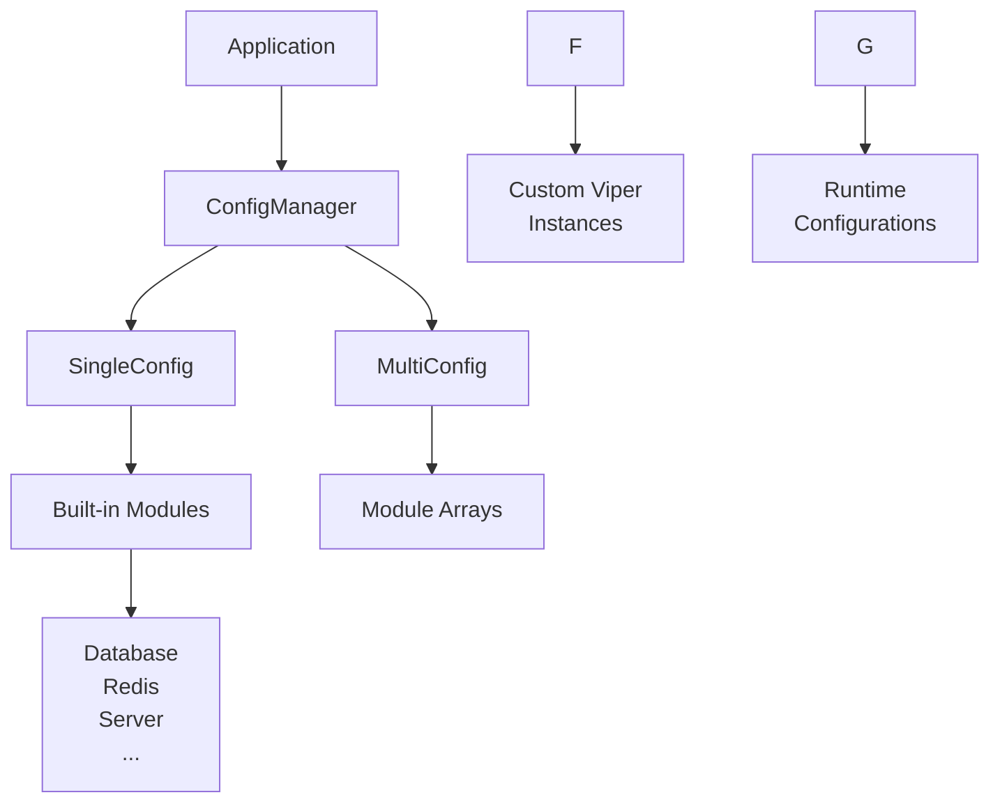

# go-config

> 🚀 **企业级 Go 配置管理框架** - 专为现代微服务架构设计，提供统一的配置加载、验证、热更新和多环境支持

<div align="center">

[](https://github.com/kamalyes/go-config)
[](https://github.com/kamalyes/go-config/blob/master/LICENSE)
[](https://github.com/kamalyes/go-config/releases)
[](https://golang.org)
[](https://codecov.io/gh/kamalyes/go-config)
[](https://goreportcard.com/report/github.com/kamalyes/go-config)
[](https://pkg.go.dev/github.com/kamalyes/go-config)

</div>

## ✨ 特性亮点

| 特性 | 说明 | 优势 |
|------|------|------|
| 🌍 **多环境支持** | dev, sit, fat, uat, prod | 一套代码，多环境部署 |
| 🔄 **配置热更新** | 基于 fsnotify 实时监听 | 无需重启应用即可更新配置 |
| 📦 **模块化配置** | 25+ 种常用服务预置配置 | 开箱即用，快速集成 |
| 🎭 **双模式管理** | SingleConfig & MultiConfig | 灵活应对不同业务场景 |
| 🛡️ **类型安全** | 强类型配置结构和验证 | 编译时发现配置错误 |
| ⚡ **高性能** | 基于 Viper，零依赖解析 | 毫秒级配置加载 |
| 🔌 **外部 Viper 支持** | 支持无关系的 Viper 实例 | 更灵活的配置管理 |
| 📊 **动态配置** | 运行时动态添加配置项 | 满足复杂业务需求 |

## 🏗️ 架构概览



## 📋 支持的配置模块

### 🔧 基础服务
- **Server** - HTTP/gRPC 服务器配置
- **CORS** - 跨域资源共享设置
- **JWT** - JSON Web Token 认证

### 💾 数据存储
- **MySQL** - MySQL 数据库连接池配置
- **PostgreSQL** - PostgreSQL 数据库配置
- **SQLite** - 轻量级数据库配置
- **Redis** - 缓存和会话存储

### 📁 文件存储
- **Minio** - 开源对象存储服务
- **AliyunOSS** - 阿里云对象存储
- **S3** - AWS S3 兼容对象存储服务
- **FTP** - 文件传输协议服务

### 📨 消息队列
- **MQTT** - 物联网消息协议
- **Kafka** - 分布式消息流平台

### 📊 监控日志
- **Zap** - 高性能结构化日志
- **Jaeger** - 分布式链路追踪
- **Elasticsearch** - 全文搜索引擎
- **PProf** - 性能分析工具

### 🔗 服务治理
- **Consul** - 服务发现和配置中心
- **Zero (go-zero)** - 微服务框架集成

### 💳 第三方服务
- **支付宝支付** - Alipay SDK 集成
- **微信支付** - WeChat Pay 接口
- **阿里云短信** - SMS 服务配置
- **阿里云 STS** - 安全令牌服务
- **有赞** - 电商平台接口

### 🛡️ 安全认证
- **Captcha** - 验证码生成配置
- **Email** - 邮件发送服务

##  快速开始

### 系统要求
- **Go 1.20+**
- **支持平台**: Linux, macOS, Windows

### 📦 安装

```bash
# 初始化项目
go mod init your-awesome-project

# 安装 go-config
go get -u github.com/kamalyes/go-config

# 整理依赖
go mod tidy
```

### ⚡ 5分钟上手

#### 1️⃣ 创建配置文件

在项目根目录创建 `resources/dev_config.yaml`：

```yaml
# 服务配置
server:
  addr: '0.0.0.0:8080'
  service-name: 'my-awesome-api'
  context-path: '/api/v1'

# 数据库配置
mysql:
  host: '127.0.0.1'
  port: '3306'
  username: 'root'
  password: 'password'
  db-name: 'myapp'
  config: 'charset=utf8mb4&parseTime=True&loc=Local'
  log-level: 'info'

# Redis 配置
redis:
  addr: '127.0.0.1:6379'
  db: 0

# 日志配置
zap:
  level: 'info'
  format: 'console'
  development: true

# 性能分析配置
pprof:
  enabled: false              # 生产环境建议关闭
  path_prefix: '/debug/pprof'

# 对象存储配置（可选，根据需要选择）
s3:
  endpoint: 'https://s3.amazonaws.com'
  region: 'us-east-1'
  access-key: 'your_access_key'
  secret-key: 'your_secret_key'
  bucket-prefix: 'myapp'
```

#### 2️⃣ 编写代码

```go
package main

import (
    "context"
    "log"
    
    goconfig "github.com/kamalyes/go-config"
)

func main() {
    // 创建配置管理器
    ctx := context.Background()
    manager, err := goconfig.NewSingleConfigManager(ctx, nil)
    if err != nil {
        log.Fatalf("配置管理器创建失败: %v", err)
    }
    
    // 获取配置
    config := manager.GetConfig()
    
    // 使用配置
    log.Printf("🚀 服务启动: %s", config.Server.Endpoint)
    log.Printf("📊 数据库: %s:%s/%s", 
        config.MySQL.Host, config.MySQL.Port, config.MySQL.Dbname)
    log.Printf("⚡ Redis: %s (DB:%d)", 
        config.Redis.Addr, config.Redis.DB)
    
    // 启动你的服务...
    startYourAwesomeService(config)
}

func startYourAwesomeService(config *goconfig.SingleConfig) {
    // 这里集成你的业务逻辑
    log.Println("✅ 服务启动成功!")
}
```

#### 3️⃣ 运行应用

```bash
# 方式一: 使用默认环境 (dev)
go run main.go

# 方式二: 指定环境变量
export APP_ENV=prod
go run main.go

# 方式三: Windows 环境
set APP_ENV=prod && go run main.go
```

## 🎯 核心概念

### 📋 配置管理模式

#### SingleConfig - 单一配置模式
适用于每种服务只需一个实例的场景：

```go
type SingleConfig struct {
    Server  register.Server   `yaml:"server"`   // 单个服务器配置
    MySQL   database.MySQL    `yaml:"mysql"`    // 单个数据库
    Redis   redis.Redis       `yaml:"redis"`    // 单个缓存
    // ...
}
```

#### MultiConfig - 多实例配置模式  
适用于需要多个同类服务实例的场景：

```go
type MultiConfig struct {
    Server  []register.Server   `yaml:"server"`   // 多个服务器
    MySQL   []database.MySQL    `yaml:"mysql"`    // 多个数据库
    Redis   []redis.Redis       `yaml:"redis"`    // 多个缓存实例
    // ...
}
```

### 🌍 环境管理

支持以下环境类型：

| 环境 | 说明 | 配置文件 |
|------|------|----------|
| `dev` | 开发环境 | `dev_config.yaml` |
| `sit` | 系统集成测试 | `sit_config.yaml` |
| `fat` | 功能验收测试 | `fat_config.yaml` |
| `uat` | 用户验收测试 | `uat_config.yaml` |
| `prod` | 生产环境 | `prod_config.yaml` |

### ⚙️ 配置优先级

1. **代码中指定** (`ConfigOptions.EnvValue`)
2. **环境变量** (`APP_ENV`)
3. **默认环境** (`dev`)

## 💡 高级功能

### 🔌 外部 Viper 支持

我们新增了对外部 Viper 实例的支持，让你可以管理任意的配置源：

```go
// 添加外部 Viper 实例
config.AddExternalViper("custom", myCustomViper)

// 获取外部 Viper
if viper, exists := config.GetExternalViper("custom"); exists {
    // 使用自定义 Viper 实例
    customValue := viper.GetString("custom.setting")
}

// 从外部 Viper 解析到结构体
type CustomConfig struct {
    Setting1 string `yaml:"setting1"`
    Setting2 int    `yaml:"setting2"`
}

var custom CustomConfig
err := config.UnmarshalFromExternalViper("custom", &custom)
```

### 📊 动态配置

支持运行时动态添加和管理配置：

```go
// 设置动态配置
config.SetDynamicConfig("feature_flags", map[string]bool{
    "new_feature":    true,
    "legacy_support": false,
})

// 获取动态配置
if flags, exists := config.GetDynamicConfig("feature_flags"); exists {
    featureFlags := flags.(map[string]bool)
    if featureFlags["new_feature"] {
        // 启用新功能
    }
}

// 获取所有动态配置键
keys := config.GetAllDynamicConfigKeys()
fmt.Printf("动态配置: %v", keys)
```

### 🔄 多实例配置示例

```yaml
# 多 MySQL 数据库配置
mysql:
  - modulename: "primary"      # 主数据库
    host: '192.168.1.10'
    port: '3306'
    username: 'root'
    password: 'primary_pass'
    db-name: 'main_db'
  
  - modulename: "replica"      # 只读副本
    host: '192.168.1.11'
    port: '3306'
    username: 'readonly'
    password: 'replica_pass'
    db-name: 'main_db'

# 多 Redis 实例配置  
redis:
  - modulename: "cache"        # 缓存实例
    addr: '192.168.1.20:6379'
    db: 0
  
  - modulename: "session"      # 会话存储
    addr: '192.168.1.21:6379'
    db: 1
```

```go
// 使用多配置管理器
manager, _ := goconfig.NewMultiConfigManager(ctx, nil)
multiConfig := manager.GetConfig()

// 获取特定模块配置
primaryDB, err := goconfig.GetModuleByName(multiConfig.MySQL, "primary")
if err == nil {
    fmt.Printf("主数据库: %s:%s", primaryDB.Host, primaryDB.Port)
}

cacheRedis, err := goconfig.GetModuleByName(multiConfig.Redis, "cache")
if err == nil {
    fmt.Printf("缓存 Redis: %s", cacheRedis.Addr)
}
```

## 🛠️ 配置模块详解

### 🔧 服务器配置 (Server)

```yaml
server:
  addr: '0.0.0.0:8080'                    # 服务监听地址
  service-name: 'user-service'             # 服务名称
  context-path: '/api/v1'                  # API 前缀路径
  handle-method-not-allowed: true          # 是否处理方法不允许错误
  data-driver: 'mysql'                     # 数据库驱动类型
```

### 💾 数据库配置

#### MySQL 配置

```yaml
mysql:
  host: '127.0.0.1'                       # 数据库地址
  port: '3306'                            # 端口
  username: 'root'                        # 用户名
  password: 'password'                    # 密码
  db-name: 'myapp'                        # 数据库名
  config: 'charset=utf8mb4&parseTime=True&loc=Local'
  log-level: 'info'                       # 日志级别: debug, info, warn, error
  max-idle-conns: 10                      # 最大空闲连接数
  max-open-conns: 100                     # 最大打开连接数
  conn-max-idle-time: 30                  # 连接最大空闲时间(秒)
  conn-max-life-time: 300                 # 连接最大生命周期(秒)
```

#### Redis 配置

```yaml
redis:
  addr: '127.0.0.1:6379'                  # Redis 地址
  password: ''                            # 密码(可选)
  db: 0                                   # 数据库索引 (0-15)
  pool-size: 100                          # 连接池大小
  min-idle-conns: 5                       # 最小空闲连接数
  max-retries: 3                          # 最大重试次数
```

### 📊 日志配置 (Zap)

```yaml
zap:
  level: 'info'                           # 日志级别
  format: 'console'                       # 输出格式: json, console
  prefix: '[MyApp]'                       # 日志前缀
  director: 'logs'                        # 日志目录
  link-name: 'logs/app.log'              # 软链接文件名
  show-line: true                         # 是否显示代码行号
  encode-level: 'LowercaseColorLevelEncoder' # 级别编码器
  log-in-console: true                    # 是否在控制台输出
  development: true                       # 是否开发模式
```

### 🌐 跨域配置 (CORS)

```yaml
cors:
  allowed-all-origins: false              # 是否允许所有来源
  allowed-origins:                        # 允许的来源列表
    - "http://localhost:3000"
    - "https://myapp.com"
  allowed-methods:                        # 允许的HTTP方法
    - "GET"
    - "POST"
    - "PUT"
    - "DELETE"
  allowed-headers:                        # 允许的请求头
    - "Authorization"
    - "Content-Type"
  allow-credentials: true                 # 是否允许携带认证信息
  max-age: "86400"                       # 预检请求缓存时间(秒)
```

### 🔐 JWT 配置

```yaml
jwt:
  signing-key: 'your-secret-key-here'     # JWT 签名密钥
  expires-time: 604800                    # 过期时间(秒) 7天
  buffer-time: 86400                      # 缓冲时间(秒) 1天
  use-multipoint: true                    # 是否启用多地登录拦截
```

### � 性能分析配置 (PProf)

```yaml
pprof:
  enabled: true                          # 是否启用 pprof
  path_prefix: "/debug/pprof"           # pprof 路径前缀
  allowed_ips:                          # 允许访问的 IP 地址列表
    - "127.0.0.1"
    - "::1"
  require_auth: false                   # 是否需要认证
  auth_token: ""                        # 认证令牌（当 require_auth 为 true 时）
  enable_logging: true                  # 是否启用请求日志
  timeout: 30                           # 超时时间（秒）
```

### 📁 文件存储配置

#### Minio 对象存储

```yaml
minio:
  host: "127.0.0.1"                      # Minio 服务地址
  port: 9000                             # 端口
  access-key: "minioadmin"               # 访问密钥
  secret-key: "minioadmin"               # 秘密密钥
```

#### 阿里云 OSS

```yaml
aliyunoss:
  access-key: "your_access_key"          # 阿里云 AccessKey
  secret-key: "your_secret_key"          # 阿里云 SecretKey  
  endpoint: "https://oss-cn-hangzhou.aliyuncs.com"
  bucket: "your_bucket_name"             # 存储桶名称
  replace-original-host: "original.example.com"
  replace-later-host: "new.example.com"
```

#### AWS S3

```yaml
s3:
  endpoint: "https://s3.ap-southeast-1.amazonaws.com"  # S3 端点地址
  region: "ap-southeast-1"               # AWS 区域
  access-key: "your_access_key"          # AWS Access Key ID  
  secret-key: "your_secret_key"          # AWS Secret Access Key
  bucket-prefix: "myapp"                 # 存储桶前缀
  session-token: ""                      # 会话令牌（临时凭证）
  use-ssl: true                          # 是否使用 HTTPS
  path-style: false                      # 是否使用路径样式访问
```

### 📨 消息队列配置

#### MQTT 配置

```yaml
mqtt:
  url: "tcp://127.0.0.1:1883"           # MQTT 服务器地址
  username: "mqtt_user"                  # 用户名
  password: "mqtt_pass"                  # 密码
  protocol-ver: 4                        # 协议版本 (3=3.1, 4=3.1.1)
  clean-session: true                    # 是否清除会话
  auto-reconnect: true                   # 是否自动重连
  keep-alive: 60                         # 保活间隔(秒)
  ping-timeout: 10                       # Ping 超时(秒)
  connect-timeout: 10                    # 连接超时(秒)
```

#### Kafka 配置

```yaml
kafka:
  brokers: "localhost:9092,localhost:9093" # Broker 地址列表
  try-times: 3                           # 重试次数
  sync-es-topic: "elasticsearch-sync"    # 同步到 ES 的主题
```

## 📁 项目结构

```text
your-project/
├── 📁 resources/                    # 配置文件目录
│   ├── 📄 dev_config.yaml         # 开发环境配置
│   ├── 📄 sit_config.yaml         # 系统集成测试环境
│   ├── 📄 fat_config.yaml         # 功能验收测试环境  
│   ├── 📄 uat_config.yaml         # 用户验收测试环境
│   ├── 📄 prod_config.yaml        # 生产环境配置
│   └── 📄 example_config.yaml     # 配置模板示例
├── 📁 internal/                    # 内部包
├── 📁 pkg/                         # 公共包
├── 📄 main.go                     # 主程序入口
├── 📄 go.mod                      # Go Modules 文件
└── 📄 go.sum                      # 依赖校验和文件
```

## 📖 完整文档

🔗 **[查看完整使用文档 →](./DOC.md)**

详细文档包含：

- 🚀 **快速开始** - 5分钟集成指南
- 🏗️ **架构设计** - 核心概念详解  
- 🔧 **API 参考** - 完整函数文档
- 📄 **配置示例** - 多环境配置模板
- 💡 **最佳实践** - 生产环境经验
- 🔍 **故障排除** - 常见问题解决

## 🤝 贡献指南

我们欢迎任何形式的贡献！

### 贡献方式

1. **🐛 报告Bug** - [提交 Issue](https://github.com/kamalyes/go-config/issues)
2. **💡 功能建议** - [功能请求](https://github.com/kamalyes/go-config/issues)  
3. **📝 改进文档** - 修改 README 或文档
4. **💻 提交代码** - Fork & Pull Request

### 开发环境搭建

```bash
# 1. Fork 并克隆项目
git clone https://github.com/your-username/go-config.git
cd go-config

# 2. 安装依赖
go mod tidy

# 3. 运行测试
go test ./...

# 4. 运行测试覆盖率
go test -race -coverprofile=coverage.txt -covermode=atomic ./...
```

### 提交规范

```bash
# 功能添加
git commit -m "feat: 新增外部Viper支持功能"

# Bug修复  
git commit -m "fix: 修复配置热更新问题"

# 文档更新
git commit -m "docs: 更新README配置示例"

# 性能优化
git commit -m "perf: 优化配置加载性能"
```

## 📋 路线图

### 🎯 v1.1.0 (规划中)
- [ ] 🔄 配置验证增强
- [ ] 📊 配置监控面板
- [ ] 🔌 插件系统支持
- [ ] 🌐 国际化支持

### 🎯 v1.2.0 (未来版本)
- [ ] ☁️ 云原生配置中心集成
- [ ] 🔐 配置加密/解密支持
- [ ] 📈 性能监控仪表板
- [ ] 🤖 智能配置推荐

## 📜 许可证

本项目采用 **MIT 许可证** - 查看 [LICENSE](LICENSE) 文件了解详情

## 🙏 致谢

感谢以下开源项目：

- [Viper](https://github.com/spf13/viper) - 强大的配置管理库
- [fsnotify](https://github.com/fsnotify/fsnotify) - 文件系统监控
- 所有贡献者和使用者的支持 ❤️

---

<div align="center">

**如果这个项目对你有帮助，请给我们一个 ⭐️**

[🏠 项目主页](https://github.com/kamalyes/go-config) •
[📖 文档](./DOC.md) •
[🐛 问题反馈](https://github.com/kamalyes/go-config/issues) •
[💬 讨论交流](https://github.com/kamalyes/go-config/discussions)

</div>
