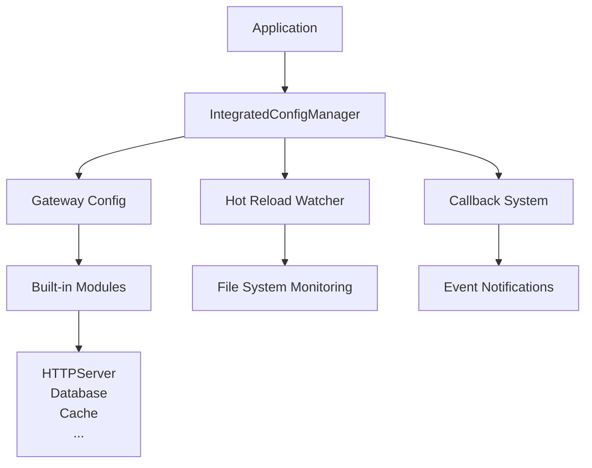

# go-config

> 🚀 **企业级 Go 配置管理框架** - 专为现代微服务架构设计，提供统一的配置加载、验证、热更新和多环境支持

<div align="center">

[](https://github.com/kamalyes/go-config)
[](https://github.com/kamalyes/go-config/blob/master/LICENSE)
[](https://github.com/kamalyes/go-config/releases)
[](https://golang.org)
[](https://codecov.io/gh/kamalyes/go-config)
[](https://goreportcard.com/report/github.com/kamalyes/go-config)
[](https://pkg.go.dev/github.com/kamalyes/go-config)

</div>

## 🎉 v1.0 新特性

| 🆕 新功能 | 🎯 亮点 |
|-----------|---------|
| **🔗 链式调用API** | `NewManager(config).WithPrefix("app").WithHotReload(nil).BuildAndStart()` |
| **🛡️ 泛型类型安全** | `config, err := GetConfigAs[MyConfig](manager)` - 编译期类型检查 |
| **🎯 智能配置发现** | 支持路径、前缀、模式匹配、自动发现四种模式 |
| **⚡ Must便捷函数** | `MustBuildAndStart()` - 快速启动，失败即panic |
| **🔄 增强回调系统** | 支持优先级、异步执行、超时控制的事件处理 |

## ✨ 特性亮点

| 特性 | 说明 | 优势 |
|------|------|------|
| 🌍 **多环境支持** | dev, sit, fat, uat, prod | 一套代码，多环境部署 |
| 🔄 **配置热更新** | 基于 fsnotify 实时监听 | 无需重启应用即可更新配置 |
| 🔍 **智能配置发现** | 自动发现和创建配置文件 | 支持多种格式，智能匹配 |
| 🔗 **流畅链式 API** | 支持链式调用的构建器模式 | 代码简洁，类型安全 |
| 🎯 **多种发现模式** | 路径、前缀、模式匹配 | 灵活适配不同项目结构 |
| 📝 **美观日志输出** | emoji 和结构化日志格式 | 配置变更一目了然 |
| 🔔 **回调机制** | 多级优先级事件通知 | 配置变更及时响应 |
| 🌐 **上下文集成** | Context 注入和中间件支持 | HTTP/gRPC 服务集成 |
| 📦 **模块化配置** | 25+ 种常用服务预置配置 | 开箱即用，快速集成 |
| 🎭 **统一管理** | IntegratedConfigManager | 灵活应对不同业务场景 |
| 🛡️ **类型安全** | 强类型配置结构和验证 | 编译时发现配置错误 |
| ⚡ **高性能** | 基于 Viper，零依赖解析 | 毫秒级配置加载 |

## 🏗️ 架构概览



## 🚀 快速开始

### 📦 安装

```bash
go mod init your-project
go get -u github.com/kamalyes/go-config
```

### ⚡ 30秒快速体验

```bash
# 1. 安装
go get github.com/kamalyes/go-config@latest

# 2. 创建配置
mkdir -p config
cat > config/gateway-dev.yaml << EOF
name: "my-awesome-gateway"
http:
  host: "0.0.0.0"
  port: 8080
  read-timeout: 30
database:
  mysql:
    host: "127.0.0.1"
    username: "root"
    password: "123456"
    db-name: "testdb"
cache:
  redis:
    addr: "127.0.0.1:6379"
    db: 0
EOF

# 3. 运行示例
go run examples/gateway_hot_reload_demo.go ./config
```

### 🆕 推荐用法（链式调用 API）

```go
package main

import (
    "context"
    "log"
    
    goconfig "github.com/kamalyes/go-config"
    "github.com/kamalyes/go-config/pkg/gateway"
)

func main() {
    // 🚀 新的链式调用 API - 简洁、类型安全、功能强大
    config := &gateway.Gateway{}
    
    // 方式1: 使用搜索路径自动发现
    manager, err := goconfig.NewManager(config).
        WithSearchPath("./config").
        WithPrefix("gateway").
        WithEnvironment(goconfig.EnvDevelopment).
        WithHotReload(nil). // 使用默认热重载配置
        BuildAndStart()
    
    if err != nil {
        log.Fatal("启动配置管理器失败:", err)
    }
    defer manager.Stop()
    
    // 方式2: 直接指定配置文件路径
    // manager, err := goconfig.NewManager(config).
    //     WithConfigPath("./config/gateway-dev.yaml").
    //     WithHotReload(nil).
    //     BuildAndStart()
    
    // 方式3: 使用模式匹配
    // manager, err := goconfig.NewManager(config).
    //     WithSearchPath("./config").
    //     WithPattern("gateway-*.yaml").
    //     WithEnvironment(goconfig.EnvProduction).
    //     BuildAndStart()
    
    // 🔔 注册配置变更回调 - 支持多种事件类型和优先级
    manager.RegisterConfigCallback(func(ctx context.Context, event goconfig.CallbackEvent) error {
        log.Printf("📝 配置已更新: %s", event.Source)
        // 自动美化日志已内置，无需手动调用
        return nil
    }, goconfig.CallbackOptions{
        ID:       "main_config_handler",
        Types:    []goconfig.CallbackType{goconfig.CallbackTypeConfigChanged},
        Priority: goconfig.CallbackPriorityHigh,
        Async:    false,
        Timeout:  time.Second * 5,
    })
    
    // 🌍 注册环境变更回调
    manager.RegisterEnvironmentCallback("env_handler", func(oldEnv, newEnv goconfig.EnvironmentType) error {
        log.Printf("🌍 环境切换: %s → %s", oldEnv, newEnv)
        return nil
    }, goconfig.CallbackPriorityHigh, false)
    
    // ✅ 类型安全的配置获取
    gatewayConfig, err := goconfig.GetConfigAs[gateway.Gateway](manager)
    if err != nil {
        log.Fatal("获取配置失败:", err)
    }
    
    // 🚀 使用配置启动服务
    log.Printf("🚀 服务启动: %s", gatewayConfig.Name)
    log.Printf("📍 HTTP服务器: %s:%d", gatewayConfig.HTTPServer.Host, gatewayConfig.HTTPServer.Port)
    
    // 🔄 支持运行时手动重载配置
    // err = manager.ReloadConfig(context.Background())
}
```

### 🔧 便捷函数（适用于简单场景）

```go
// 快速创建（使用默认选项）
manager, err := goconfig.CreateIntegratedManager(config, "./config/app.yaml", goconfig.EnvProduction)

// Must版本（失败时panic，适用于启动阶段）
manager := goconfig.NewManager(config).
    WithConfigPath("./config/app.yaml").
    MustBuildAndStart()
```

## 🛠️ API 使用指南

### 📋 配置发现模式对比

| 模式 | 适用场景 | 优势 | 示例 |
|------|----------|------|------|
| **直接路径** | 明确知道配置文件位置 | 最快速，无需搜索 | `WithConfigPath("./app.yaml")` |
| **前缀匹配** | 标准项目结构 | 环境自动适配 | `WithPrefix("gateway")` |
| **模式匹配** | 复杂文件命名规则 | 最灵活的匹配 | `WithPattern("config-*.json")` |
| **自动发现** | 快速原型开发 | 零配置启动 | `WithSearchPath("./config")` |

### 🎯 典型使用场景

#### 场景1: 微服务网关配置

```go
// 多环境网关配置管理
config := &gateway.Gateway{}
manager, err := goconfig.NewManager(config).
    WithSearchPath("./config").
    WithPrefix("gateway").
    WithEnvironment(goconfig.GetEnvironment()). // 从环境变量读取
    WithHotReload(&goconfig.HotReloadConfig{
        Enabled: true,
        Debounce: time.Second * 2,
    }).
    BuildAndStart()
```

#### 场景2: 单体应用配置

```go
// 简单直接的单文件配置
config := &MyAppConfig{}
manager := goconfig.NewManager(config).
    WithConfigPath("./configs/app-prod.yaml").
    WithHotReload(nil).
    MustBuildAndStart() // 启动失败时panic
```

#### 场景3: 容器化部署配置

```go
// 支持环境变量和多种发现方式
config := &ServiceConfig{}
manager, err := goconfig.NewManager(config).
    WithSearchPath("/app/config").       // 容器内配置目录
    WithPattern("service-*.yaml").       // 模式匹配
    WithEnvironment(goconfig.EnvProduction).
    WithContext(&goconfig.ContextKeyOptions{
        Value: "k8s-service",
    }).
    BuildAndStart(ctx) // 带超时控制的启动
```

### 🔄 高级功能示例

#### 多回调处理

```go
// 配置变更回调
manager.RegisterConfigCallback(func(ctx context.Context, event goconfig.CallbackEvent) error {
    // 重启HTTP服务器
    return restartHTTPServer(event.NewValue)
}, goconfig.CallbackOptions{
    ID: "http_restart",
    Types: []goconfig.CallbackType{goconfig.CallbackTypeConfigChanged},
    Priority: goconfig.CallbackPriorityHigh,
})

// 错误处理回调  
manager.RegisterConfigCallback(func(ctx context.Context, event goconfig.CallbackEvent) error {
    log.Error("配置错误", "error", event.Error)
    // 发送告警到监控系统
    return sendAlert(event.Error)
}, goconfig.CallbackOptions{
    ID: "error_alert",
    Types: []goconfig.CallbackType{goconfig.CallbackTypeError},
    Async: true,
})
```

#### 运行时配置操作

```go
// 运行时重新加载配置
err = manager.ReloadConfig(context.Background())

// 动态切换环境
err = manager.SetEnvironment(goconfig.EnvProduction)

// 获取配置元数据
metadata := manager.GetConfigMetadata()
fmt.Printf("配置文件: %s, 更新时间: %v", metadata["config_path"], metadata["updated_at"])
```

## 📋 支持的配置模块

### 🔧 基础服务

- **Server** - HTTP/gRPC 服务器配置
- **CORS** - 跨域资源共享设置
- **JWT** - JSON Web Token 认证

### 💾 数据存储

- **MySQL** - MySQL 数据库连接池配置
- **PostgreSQL** - PostgreSQL 数据库配置
- **SQLite** - 轻量级数据库配置
- **Redis** - 缓存和会话存储

### 📁 文件存储

- **Minio** - 开源对象存储服务
- **AliyunOSS** - 阿里云对象存储
- **S3** - AWS S3 兼容对象存储服务
- **FTP** - 文件传输协议服务

### 📨 消息队列

- **MQTT** - 物联网消息协议
- **Kafka** - 分布式消息流平台

### 📊 监控日志

- **Zap** - 高性能结构化日志
- **Jaeger** - 分布式链路追踪
- **Elasticsearch** - 全文搜索引擎
- **PProf** - 性能分析工具

### 🔗 服务治理

- **Consul** - 服务发现和配置中心
- **Zero (go-zero)** - 微服务框架集成

### 💳 第三方服务

- **支付宝支付** - Alipay SDK 集成
- **微信支付** - WeChat Pay 接口
- **阿里云短信** - SMS 服务配置
- **阿里云 STS** - 安全令牌服务
- **有赞** - 电商平台接口

### 🛡️ 安全认证

- **Captcha** - 验证码生成配置
- **Email** - 邮件发送服务

## 📖 详细文档

🔗 **[查看完整使用文档 →](./USAGE.md)**

详细文档包含：

- 🚀 **快速开始** - 5分钟集成指南
- 🏗️ **架构设计** - 核心概念详解  
- 🔧 **API 参考** - 完整函数文档
- 📄 **配置示例** - 多环境配置模板
- 💡 **最佳实践** - 生产环境经验
- 🔍 **故障排除** - 常见问题解决

## 🌍 环境管理

| 环境 | 说明 | 配置文件模式 |
|------|------|----------|
| `dev` | 开发环境 | `{type}-dev.{ext}` 或 `dev/{type}.{ext}` |
| `sit` | 系统集成测试 | `{type}-sit.{ext}` 或 `sit/{type}.{ext}` |
| `fat` | 功能验收测试 | `{type}-fat.{ext}` 或 `fat/{type}.{ext}` |
| `uat` | 用户验收测试 | `{type}-uat.{ext}` 或 `uat/{type}.{ext}` |
| `prod` | 生产环境 | `{type}-prod.{ext}` 或 `prod/{type}.{ext}` |

```bash
# 设置环境
export APP_ENV=prod
# 或 Windows
set APP_ENV=prod && go run main.go
```

## 📁 项目结构

```text
your-project/
├── 📁 config/                       # 配置文件目录
│   ├── 📄 gateway-dev.yaml         # 开发环境配置
│   ├── 📄 gateway-sit.yaml         # 系统集成测试环境
│   ├── 📄 gateway-fat.yaml         # 功能验收测试环境  
│   ├── 📄 gateway-uat.yaml         # 用户验收测试环境
│   ├── 📄 gateway-prod.yaml        # 生产环境配置
│   └── 📄 gateway.yaml             # 通用配置模板
├── 📁 internal/                    # 内部包
├── 📁 pkg/                         # 公共包
├── 📄 main.go                      # 主程序入口
├── 📄 go.mod                       # Go Modules 文件
└── 📄 go.sum                       # 依赖校验和文件
```

## 🤝 贡献指南

我们欢迎任何形式的贡献！

### 贡献方式

1. **🐛 报告Bug** - [提交 Issue](https://github.com/kamalyes/go-config/issues)
2. **💡 功能建议** - [功能请求](https://github.com/kamalyes/go-config/issues)  
3. **📝 改进文档** - 修改 README 或文档
4. **💻 提交代码** - Fork & Pull Request

### 开发环境搭建

```bash
# 1. Fork 并克隆项目
git clone https://github.com/your-username/go-config.git
cd go-config

# 2. 安装依赖
go mod tidy

# 3. 运行测试
go test ./...

# 4. 运行测试覆盖率
go test -race -coverprofile=coverage.txt -covermode=atomic ./...
```

## 📋 路线图

### ✅ v1.0.0 (已完成)

- [x] 🔗 链式调用API (ManagerBuilder)
- [x] 🎯 多种配置发现模式 (路径、前缀、模式、自动发现)
- [x] 🛡️ 泛型类型安全 (GetConfigAs[T])
- [x] 🔄 增强的回调机制 (优先级、异步、超时)
- [x] 📝 完整的函数注释和文档

### 🎯 v1.1.0 (规划中)

- [ ] 🔍 配置Schema验证 (JSON Schema / Go struct tags)
- [ ] 📊 配置监控面板 (Web UI)
- [ ] 🔌 插件系统支持 (自定义配置解析器)
- [ ] 🌐 国际化支持 (多语言错误消息)
- [ ] 🧪 配置A/B测试支持

### 🎯 v1.2.0 (未来版本)

- [ ] ☁️ 云原生配置中心集成 (Consul, etcd, Nacos)
- [ ] 🔐 配置加密/解密支持 (AES, RSA)
- [ ] 📈 配置性能监控仪表板
- [ ] 🤖 智能配置推荐和优化建议
- [ ] 🔄 配置版本控制和回滚

## 📜 许可证

本项目采用 **MIT 许可证** - 查看 [LICENSE](LICENSE) 文件了解详情

## 🙏 致谢

感谢以下开源项目：

- [Viper](https://github.com/spf13/viper) - 强大的配置管理库
- [fsnotify](https://github.com/fsnotify/fsnotify) - 文件系统监控
- 所有贡献者和使用者的支持 ❤️

---

## 如果这个项目对你有帮助，请给我们一个 ⭐️

[🏠 项目主页](https://github.com/kamalyes/go-config) •
[📖 详细文档](./USAGE.md) •
[🐛 问题反馈](https://github.com/kamalyes/go-config/issues) •
[💬 讨论交流](https://github.com/kamalyes/go-config/discussions)
