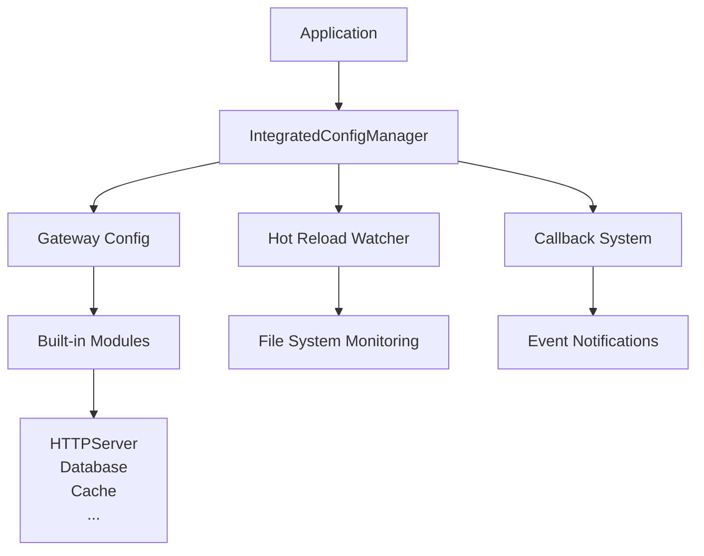

# go-config

> 🚀 **企业级 Go 配置管理框架** - 专为现代微服务架构设计，提供统一的配置加载、验证、热更新和多环境支持

<div align="center">

[](https://github.com/kamalyes/go-config)
[](https://github.com/kamalyes/go-config/blob/master/LICENSE)
[](https://github.com/kamalyes/go-config/releases)
[](https://golang.org)
[](https://codecov.io/gh/kamalyes/go-config)
[](https://goreportcard.com/report/github.com/kamalyes/go-config)
[](https://pkg.go.dev/github.com/kamalyes/go-config)

</div>

## ✨ 特性亮点

| 特性 | 说明 | 优势 |
|------|------|------|
| 🌍 **多环境支持** | dev, sit, fat, uat, prod | 一套代码，多环境部署 |
| 🔄 **配置热更新** | 基于 fsnotify 实时监听 | 无需重启应用即可更新配置 |
| 🔍 **智能配置发现** | 自动发现和创建配置文件 | 支持多种格式，智能匹配 |
| 📝 **美观日志输出** | emoji 和结构化日志格式 | 配置变更一目了然 |
| 🔔 **回调机制** | 多级优先级事件通知 | 配置变更及时响应 |
| 🌐 **上下文集成** | Context 注入和中间件支持 | HTTP/gRPC 服务集成 |
| 📦 **模块化配置** | 25+ 种常用服务预置配置 | 开箱即用，快速集成 |
| 🎭 **统一管理** | IntegratedConfigManager | 灵活应对不同业务场景 |
| 🛡️ **类型安全** | 强类型配置结构和验证 | 编译时发现配置错误 |
| ⚡ **高性能** | 基于 Viper，零依赖解析 | 毫秒级配置加载 |

## 🏗️ 架构概览



## 🚀 快速开始

### 📦 安装

```bash
go mod init your-project
go get -u github.com/kamalyes/go-config
```

### ⚡ 30秒快速体验

```bash
# 1. 安装
go get github.com/kamalyes/go-config@latest

# 2. 创建配置
mkdir -p config
cat > config/gateway-dev.yaml << EOF
name: "my-awesome-gateway"
http:
  host: "0.0.0.0"
  port: 8080
  read-timeout: 30
database:
  mysql:
    host: "127.0.0.1"
    username: "root"
    password: "123456"
    db-name: "testdb"
cache:
  redis:
    addr: "127.0.0.1:6379"
    db: 0
EOF

# 3. 运行示例
go run examples/gateway_hot_reload_demo.go ./config
```

### 🆕 推荐用法

```go
package main

import (
    "context"
    "log"
    
    goconfig "github.com/kamalyes/go-config"
    "github.com/kamalyes/go-config/pkg/gateway"
)

func main() {
    // 自动发现配置文件
    config := &gateway.Gateway{}
    manager, err := goconfig.CreateAndStartIntegratedManagerWithAutoDiscovery(
        config, "./config", goconfig.GetEnvironment(), "gateway")
    if err != nil {
        log.Fatal(err)
    }
    defer manager.Stop()
    
    // 注册配置变更回调
    manager.RegisterConfigCallback(func(ctx context.Context, event goconfig.CallbackEvent) error {
        goconfig.LogConfigChange(event, event.NewValue)
        return nil
    }, goconfig.CallbackOptions{
        ID:       "main_handler",
        Types:    []goconfig.CallbackType{goconfig.CallbackTypeConfigChanged},
        Priority: goconfig.CallbackPriorityHigh,
    })
    
    // 使用配置
    gatewayConfig := manager.GetConfig().(*gateway.Gateway)
    log.Printf("🚀 服务启动: %s", gatewayConfig.Name)
    log.Printf("📍 HTTP服务器: %s", gatewayConfig.HTTPServer.GetEndpoint())
}
```

## 📋 支持的配置模块

### 🔧 基础服务

- **Server** - HTTP/gRPC 服务器配置
- **CORS** - 跨域资源共享设置
- **JWT** - JSON Web Token 认证

### 💾 数据存储

- **MySQL** - MySQL 数据库连接池配置
- **PostgreSQL** - PostgreSQL 数据库配置
- **SQLite** - 轻量级数据库配置
- **Redis** - 缓存和会话存储

### 📁 文件存储

- **Minio** - 开源对象存储服务
- **AliyunOSS** - 阿里云对象存储
- **S3** - AWS S3 兼容对象存储服务
- **FTP** - 文件传输协议服务

### 📨 消息队列

- **MQTT** - 物联网消息协议
- **Kafka** - 分布式消息流平台

### 📊 监控日志

- **Zap** - 高性能结构化日志
- **Jaeger** - 分布式链路追踪
- **Elasticsearch** - 全文搜索引擎
- **PProf** - 性能分析工具

### 🔗 服务治理

- **Consul** - 服务发现和配置中心
- **Zero (go-zero)** - 微服务框架集成

### 💳 第三方服务

- **支付宝支付** - Alipay SDK 集成
- **微信支付** - WeChat Pay 接口
- **阿里云短信** - SMS 服务配置
- **阿里云 STS** - 安全令牌服务
- **有赞** - 电商平台接口

### 🛡️ 安全认证

- **Captcha** - 验证码生成配置
- **Email** - 邮件发送服务

## 📖 详细文档

🔗 **[查看完整使用文档 →](./USAGE.md)**

详细文档包含：

- 🚀 **快速开始** - 5分钟集成指南
- 🏗️ **架构设计** - 核心概念详解  
- 🔧 **API 参考** - 完整函数文档
- 📄 **配置示例** - 多环境配置模板
- 💡 **最佳实践** - 生产环境经验
- 🔍 **故障排除** - 常见问题解决

## 🌍 环境管理

| 环境 | 说明 | 配置文件模式 |
|------|------|----------|
| `dev` | 开发环境 | `{type}-dev.{ext}` 或 `dev/{type}.{ext}` |
| `sit` | 系统集成测试 | `{type}-sit.{ext}` 或 `sit/{type}.{ext}` |
| `fat` | 功能验收测试 | `{type}-fat.{ext}` 或 `fat/{type}.{ext}` |
| `uat` | 用户验收测试 | `{type}-uat.{ext}` 或 `uat/{type}.{ext}` |
| `prod` | 生产环境 | `{type}-prod.{ext}` 或 `prod/{type}.{ext}` |

```bash
# 设置环境
export APP_ENV=prod
# 或 Windows
set APP_ENV=prod && go run main.go
```

## 📁 项目结构

```text
your-project/
├── 📁 config/                       # 配置文件目录
│   ├── 📄 gateway-dev.yaml         # 开发环境配置
│   ├── 📄 gateway-sit.yaml         # 系统集成测试环境
│   ├── 📄 gateway-fat.yaml         # 功能验收测试环境  
│   ├── 📄 gateway-uat.yaml         # 用户验收测试环境
│   ├── 📄 gateway-prod.yaml        # 生产环境配置
│   └── 📄 gateway.yaml             # 通用配置模板
├── 📁 internal/                    # 内部包
├── 📁 pkg/                         # 公共包
├── 📄 main.go                      # 主程序入口
├── 📄 go.mod                       # Go Modules 文件
└── 📄 go.sum                       # 依赖校验和文件
```

## 🤝 贡献指南

我们欢迎任何形式的贡献！

### 贡献方式

1. **🐛 报告Bug** - [提交 Issue](https://github.com/kamalyes/go-config/issues)
2. **💡 功能建议** - [功能请求](https://github.com/kamalyes/go-config/issues)  
3. **📝 改进文档** - 修改 README 或文档
4. **💻 提交代码** - Fork & Pull Request

### 开发环境搭建

```bash
# 1. Fork 并克隆项目
git clone https://github.com/your-username/go-config.git
cd go-config

# 2. 安装依赖
go mod tidy

# 3. 运行测试
go test ./...

# 4. 运行测试覆盖率
go test -race -coverprofile=coverage.txt -covermode=atomic ./...
```

## 📋 路线图

### 🎯 v1.1.0 (规划中)

- [ ] 🔄 配置验证增强
- [ ] 📊 配置监控面板
- [ ] 🔌 插件系统支持
- [ ] 🌐 国际化支持

### 🎯 v1.2.0 (未来版本)

- [ ] ☁️ 云原生配置中心集成
- [ ] 🔐 配置加密/解密支持
- [ ] 📈 性能监控仪表板
- [ ] 🤖 智能配置推荐

## 📜 许可证

本项目采用 **MIT 许可证** - 查看 [LICENSE](LICENSE) 文件了解详情

## 🙏 致谢

感谢以下开源项目：

- [Viper](https://github.com/spf13/viper) - 强大的配置管理库
- [fsnotify](https://github.com/fsnotify/fsnotify) - 文件系统监控
- 所有贡献者和使用者的支持 ❤️

---

## 如果这个项目对你有帮助，请给我们一个 ⭐️

[🏠 项目主页](https://github.com/kamalyes/go-config) •
[📖 详细文档](./USAGE.md) •
[🐛 问题反馈](https://github.com/kamalyes/go-config/issues) •
[💬 讨论交流](https://github.com/kamalyes/go-config/discussions)
